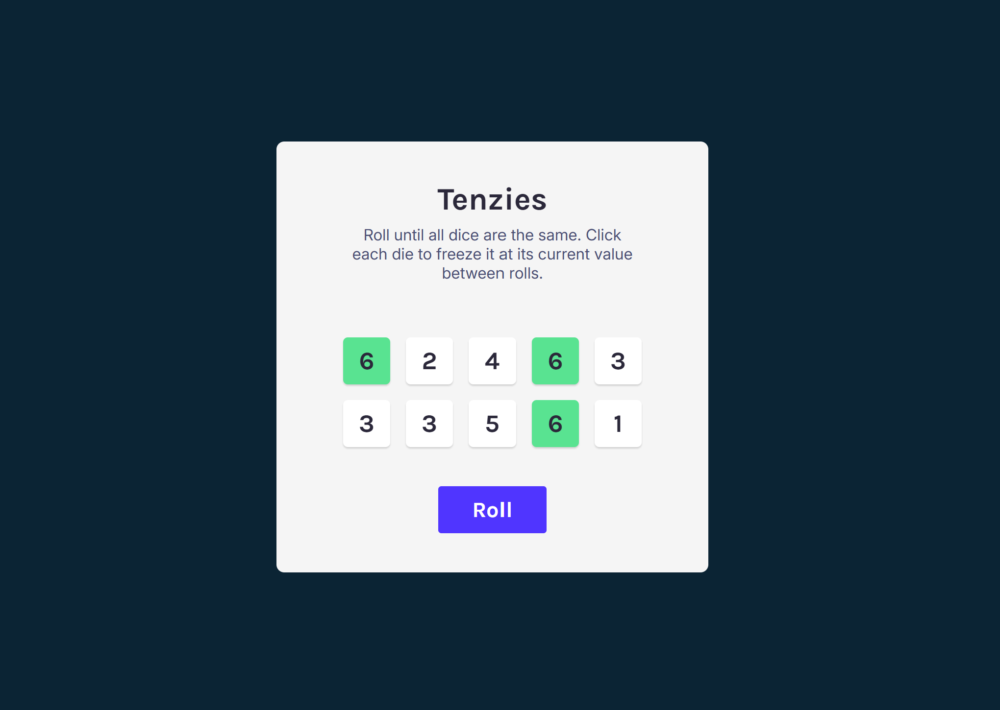
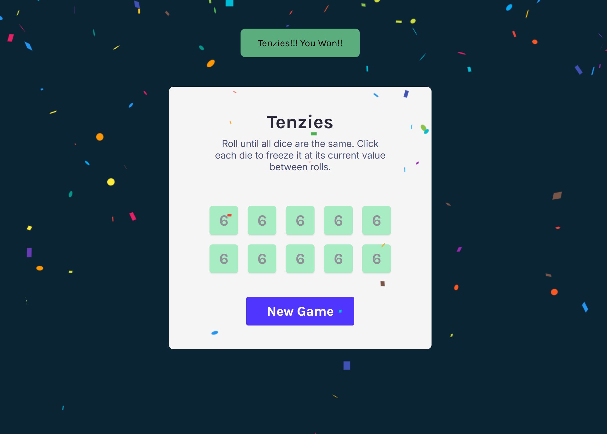

# Tenzies 🎲 

A fun dice game built with React! The goal is to roll until all 10 dice show the same number. You can hold dice between rolls to lock in their values. When all dice match and are held, you win and a colorful confetti rains down to celebrate your victory!

## 🚀 Features

- 🎯 **Objective**: Roll 10 dice until all of them show the same number.
- 🎲 **Interactive Dice**:
  - Click on a die to **hold** its value.
  - Held dice remain unchanged during the next roll.
- 🔁 **Roll Button**:
  - Rolls all **unheld** dice with new random values.
  - Updates dice on each click unless the game is won.
- 🎉 **Winning Condition**:
  - When **all dice have the same value** and are **all held**, the game is won.
  - Confetti animation plays using the `react-confetti` package.
  - The **"Roll"** button is replaced with a **"New Game"** button.
- ⏳ **Confetti Timeout**:
  - Confetti runs for a few seconds and then stops automatically using `useEffect`.

## 🛠️ Technologies

- **Vite**: Lightning-fast development and build tool.
- **React.js**: For building the interactive UI and managing game state.
- **JavaScript (ES6+)**: Game logic and event handling.
- **HTML5**: Structuring the game layout.
- **CSS3**: Styling dice, buttons, and animations.

## 📸 Preview





## 📽️ Demo
Check out the live demo of the Tenzies App [here](https://the1fatkid.github.io/tenzies-game/).

## 🚀 Getting Started
To set up the project locally for development and testing, follow these steps:

1. **Clone the Repository**:
    ```bash
    git clone https://github.com/the1fatkid/tenzies-game.git
    ```

2. **Navigate to the Project Directory**:
    ```bash
    cd tenzies-game
    ```

3. **Install Dependencies**:
    ```bash
    npm install
    ```

4. **Start the Development Server**:
    ```bash
    npm run dev
    ```

5. **Open the App**:
   Visit `http://localhost:5173` (or the URL specified by Vite) in your browser to interact with the app.

<br><br>

*Thanks for checking out my Tenzies App! Have fun playing! 😄*   
